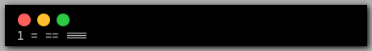

# Cascadia Code fork with a joined equals ligature

This is a fork of Cascadia Code, with the joined `==` ligature added back.

## Images (taken from Kate)

Current Cascadia Code:  
  

This fork of Cascadia Code:  


## Build Requirements

- Python 3.12 (as far as I know)

### How to build

Setup a `venv`, install requirements, and run the build script.

```sh
python3.12 -m venv venv
source venv/bin/activate
pip install -U pip setuptools wheel
pip install -r requirements.txt
```
